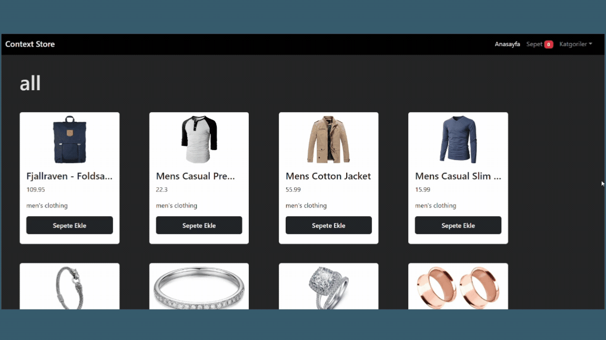

# E-Commerce React Vite Application

- This project is an e-commerce website built using modern JavaScript and React technologies. Users can add products to the cart, remove products from the cart, filter products by categories, and see the total number of products and total price in the cart. The project is built using the following technologies and libraries:

## Technologies Used

- React: To build the user interface.
- Vite: For fast development and build.
- Axios: For data exchange with the API.
- React Router DOM: For navigating between pages within the application.
- Bootstrap: For responsive design and styling.
- React Toastify: For notifications and feedback messages.
- Context API: For sharing data and managing state across the application.
- React Icons: For using icons.
- useEffect and useState Hooks: For managing component state and side effects.

# Application E-Commerce React Vite

- Ce projet est un site de commerce électronique construit en utilisant les technologies modernes de JavaScript et React. Les utilisateurs peuvent ajouter des produits au panier, retirer des produits du panier, filtrer les produits par catégories et voir le nombre total de produits et le prix total dans le panier. Le projet est construit en utilisant les technologies et bibliothèques suivantes

## Technologies Utilisées

- React : Pour construire l'interface utilisateur.
- Vite : Pour un développement et une compilation rapide.
- Axios : Pour l'échange de données avec l'API.
- React Router DOM : Pour naviguer entre les pages de l'application.
- Bootstrap : Pour le design et le style réactif.
- React Toastify : Pour les notifications et les messages de retour.
- Context API : Pour partager les données et gérer l'état à travers l'application.
- React Icons : Pour utiliser des icônes.
  Hooks useEffect et useState : Pour gérer l'état des composants et les effets secondaires.

## GIF

